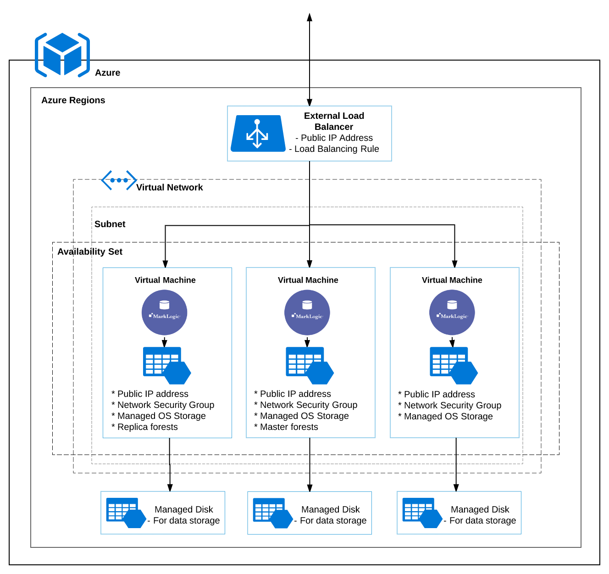

# MarkLogic Solution Template on Azure

The Solution Template for MarkLogic on Azure helps to deploy clusters on Azure. It is publicly offered on Azure Marketplace. This repository contains templates and resources to set up and initialize MarkLogic clusters with Azure features: Availability Set, Virtual Network, Application Gateway, Network Security Group, Virtual Machines, etc. MarkLogic features such as local-disk failover will be configured for the cluster.

For deploying MarkLogic on AWS, please visit [cloud-enablement-aws](https://github.com/marklogic/cloud-enablement-aws).

**ATTENTION: We have discovered and confirmed an unintended backward compatibility issue in MarkLogic Server versions 12.0.2 and 11.3.5, which affects how MarkLogic REST API executes REST extensions with specific user privileges. As a result, any use of MarkLogic [REST API extensions](https://docs.progress.com/bundle/marklogic-server-develop-rest-api-12/page/topics/extensions.html#understanding-resource-service-extensions) may cause unexpected errors. We are working with highest priority to provide a product update with a fix as soon as possible. If your implementation relies on this functionality, we recommend delaying an upgrade until a new release is available. If you believe this issue may affect or has affected your implementation please contact Support for recommendations.**

## Getting Started

 

* To deploy from Azure Web Portal, navigate to [Azure Marketplace](https://azuremarketplace.microsoft.com/en-us/marketplace/apps?search=marklogic&page=1)
* To deploy from this repository, click the `Deploy to Azure` button under the title  
* To deploy using Azure CLI (or other tools), refer to the Microsoft Azure [article](https://learn.microsoft.com/en-us/azure/azure-resource-manager/templates/deploy-cli)
* To see the visualization of deployment structures, click Azure [here](http://armviz.io/#/?load=https://raw.githubusercontent.com/marklogic/cloud-enablement-azure/11.0-master/mainTemplate.json).

## Reference Architecture

The Solution Template exposes a set of parameters enabling users to configure the MarkLogic cluster on Azure. Using the parameter values, users can choose to provision one node or three node clusters with Aazure features including Availability Set, Virtual Network, Application Gateway, Network Security Group, and Virtual Machines.

The virtual machines provisioned by the template will each be initialized as a MarkLogic node and joined together as a cluster. Advanced features including MarkLogic local-disk failover can be also configured on the cluster. The following image shows a typical architecture of the cluster on Azure.

The Solution Template consists of a mainTemplate, createUiDefinition, several sub-templates, and shell scripts for configuring MarkLogic cluster. The mainTemplate is the main entrance of the template. It links and invokes sub-templates as needed. The createUiDefinition is used to define Azure Marketplace interface. If you are deploying from this repository or using Azure CLI, createUiDefinition won't be used.

## Documentation

- [MarkLogic Server on Azure Guide](http://docs.marklogic.com/guide/azure)
- [MarkLogic on Azure](https://developer.marklogic.com/products/cloud/azure)  

## Support

The cloud-enablement-azre repository is maintained by MarkLogic Engineering and distributed under the [Apache 2.0 license](https://github.com/marklogic/cloud-enablement-azure/blob/master/LICENSE.TXT). Everyone is encouraged to file bug reports, feature requests, and pull requests through [GitHub](https://github.com/marklogic/cloud-enablement-azure/issues/new). Your input is important and will be carefully considered. However, we can’t promise a specific resolution or timeframe for any request. In addition, MarkLogic provides technical support for [releases](https://github.com/marklogic/cloud-enablement-azure/releases) of cloud-enablement-azure to licensed customers under the terms outlined in the [Support Handbook](http://www.marklogic.com/files/Mark_Logic_Support_Handbook.pdf). For more information or to sign up for support, visit [help.marklogic.com](http://help.marklogic.com).
